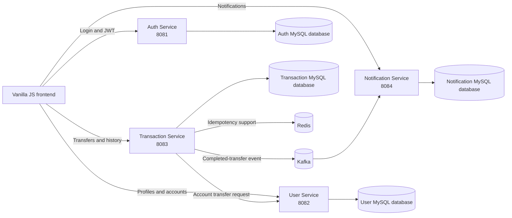
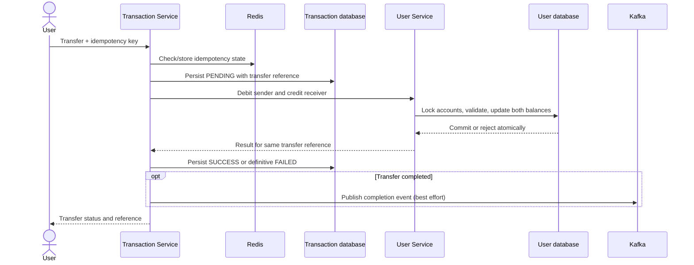
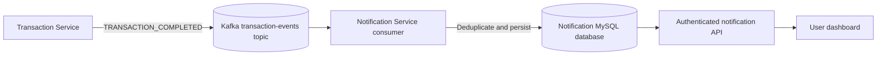

# Distributed Banking System

A learning-focused banking application built with Java and Spring Boot microservices. It demonstrates authentication, user and account management, transfers, profile-change approval, and Kafka-driven in-app notifications. The project is intended for learning and portfolio discussion; it is not a production banking platform.

## Key features

- Admin-created users with login credentials; users do not self-register.
- JWT-based login and role-based access for `ADMIN` and `USER` accounts.
- User profiles, bank accounts, balances, and account status.
- Money transfers with a Transaction Service workflow, transfer references, persisted status, and duplicate-request protection.
- User profile-change requests that an admin can approve or reject.
- In-app notifications for completed transfers, stored and displayed in the user dashboard.
- A basic admin and user interface using HTML, CSS, and vanilla JavaScript.

## Architecture overview



The browser calls the services directly using the configured local URLs. There is no API Gateway in the current project. Docker Compose provides the local infrastructure configuration; application services are run separately.

## Microservices

| Service | Local port | Responsibility |
| --- | ---: | --- |
| Auth Service | 8081 | Stores credentials, authenticates login, and issues JWTs with user identity and role claims. |
| User Service | 8082 | Manages user profiles, accounts, account balance operations, and profile-change approval requests. |
| Transaction Service | 8083 | Orchestrates transfers, records transfer status and history, handles idempotency, and publishes completion events. |
| Notification Service | 8084 | Consumes completed-transfer events, persists notifications, and provides authenticated notification endpoints. |

## Technology stack

- Java 21 and Spring Boot
- Spring Web, Spring Security, Spring Data JPA, and Hibernate
- MySQL with Flyway migrations
- Redis for transfer idempotency support
- Kafka for asynchronous transfer-completion events
- JWT and BCrypt
- Maven
- Docker Compose for local infrastructure
- HTML, CSS, and vanilla JavaScript for the frontend

## Authentication and authorization

Users log in through the Auth Service. The service verifies credentials and returns a signed JWT. Passwords are stored using BCrypt; the frontend sends the access token in the `Authorization: Bearer` header for protected requests.

The token carries the user ID and role. The services use these claims for authorization and to scope user-owned resources. Admin-only operations include creating users and reviewing profile-change requests. User endpoints restrict profile and notification access to the authenticated user where applicable. JWT signing configuration is shared through environment/configuration settings; secret values must be supplied locally and must never be committed to the repository.

## Money transfer workflow

The Transaction Service coordinates the transfer and tracks its state. The User Service performs the debit and credit as one database transaction and uses account locking and transfer-reference duplicate protection. The Transaction Service reuses the same reference when it retries or recovers an uncertain outcome.



This is centralized orchestration and is **Saga-inspired**, but it is not a complete Saga with compensation. The account debit and credit are atomic within the User Service database transaction; the Transaction Service database, Redis, User Service database, and Kafka do not share one distributed transaction. A persisted `PENDING` transfer and stable reference help identify and retry uncertain outcomes, but operational reconciliation and event-delivery guarantees remain limited (see [Future improvements](#future-improvements)).

## Redis and idempotency

The Transaction Service uses Redis as part of its idempotency handling so retries carrying the same idempotency key can be recognized instead of treated as new transfer requests. Transfer references and User Service duplicate-reference checks provide additional protection around account updates. Redis is not the financial ledger: transfer and account records are stored in MySQL.

Idempotency does not mean every failure is automatically recoverable. A timeout can leave an outcome uncertain, and Redis state alone cannot make a multi-service operation atomic. The implementation relies on retaining and reusing the same reference when resolving such an attempt.

## Kafka notification flow

After a transfer is completed, the Transaction Service publishes a `TRANSACTION_COMPLETED` event to Kafka. The Notification Service consumes the event and records `MONEY_SENT` and `MONEY_RECEIVED` notifications. The notification records are then available to the authenticated user dashboard.



Notification creation is deduplicated using transaction ID, user ID, and notification type, with a database uniqueness constraint as the final duplicate guard. Notifications are generated only for completed-transfer events. Kafka publishing is best effort in the current workflow: a transactional outbox, dead-letter queue, and guaranteed event delivery are not implemented.

## Database and Flyway migrations

Each service owns its persistence model and MySQL database configuration. Entities use JPA, and Flyway SQL scripts version the schemas. Hibernate is configured to validate rather than create/alter schemas automatically in the Notification Service. Review each service's configuration and migration scripts before running locally; do not point this learning project at real banking data. Starting services may execute enabled Flyway migrations, so inspect that behavior and the configured database targets first.

## Profile-change approval workflow

Users submit a change request for supported profile fields. The User Service records it as pending. An admin can list pending requests and approve or reject one. An approved request updates the user profile; a rejected request leaves it unchanged. The dashboard displays the user's request history. The current request flow covers profile fields such as full name, email, phone, and address.

## Error handling and transaction consistency

Services use request validation, service-layer checks, and exception handlers for common errors such as missing resources, conflicts, invalid requests, and denied access. For a transfer, the User Service owns the atomic balance update and account locking; the Transaction Service separately persists transfer state and history. This boundary means the overall workflow is not a single ACID transaction across services. Kafka publication is also outside the account database commit and has no outbox-backed guarantee.

## Project structure

```text
.
├── auth-service/          # Login, credentials, JWT issuance
├── user-service/          # Users, accounts, profile requests, balance operations
├── transaction-service/   # Transfers, idempotency, transfer history
├── notification-service/  # Kafka consumer and in-app notifications
├── frontend/              # Admin and user HTML/CSS/JavaScript
└── docker-compose.yml     # Local infrastructure configuration
```

Each service contains its own Maven project, source code, resources, migrations, and tests.

## Prerequisites

- Java 21
- Docker Desktop with Docker Compose, for the local infrastructure defined in `docker-compose.yml`
- Maven Wrapper files included with the service projects (or a compatible Maven installation)
- A browser and a simple static-file server for the frontend (for example, VS Code Live Server)
- Local environment configuration for each service's database, JWT, Redis, and Kafka settings

Use local development data only. Do not commit passwords, JWT signing keys, database credentials, or other secrets. Do not copy production credentials into a local environment.

## Local setup and run instructions

1. Clone the repository and open the project root in your IDE.
2. Inspect `docker-compose.yml` and each service's application configuration. Confirm the configured databases and local infrastructure targets before starting anything.
3. Configure required environment variables in your local shell or IDE Run Configurations. Use the same JWT signing secret for Auth, User, Transaction, and Notification Services. Keep values out of source control and logs.
4. Start the infrastructure services defined by Docker Compose:

   ```powershell
   docker compose up -d
   ```

5. Start the Spring Boot applications from the IDE, using their existing Run Configurations. The expected service ports are 8081 (Auth), 8082 (User), 8083 (Transaction), and 8084 (Notification).
6. Serve the `frontend/` directory with a static-file server on the origin allowed by the service CORS configuration (commonly `http://localhost:5500`). Open `index.html` in the browser through that server.
7. Use an admin account created for local development to create test users. Use separate test accounts when trying transfers. Verify that the frontend points to the same local service ports.

Starting an application can connect to its configured infrastructure and may run enabled migrations. Check the selected environment and database first. Avoid using a real account or real funds.

## Example API endpoints

The examples below document routes; they are not executed by this README.

| Service | Method | Endpoint | Purpose |
| --- | --- | --- | --- |
| Auth | `POST` | `/api/v1/auth/login` | Authenticate and obtain a JWT |
| User | `POST` | `/api/v1/users` | Admin creates a user and account |
| User | `GET` | `/api/v1/users/{userId}` | Get an authorized user's profile |
| User | `GET` | `/api/v1/accounts/me` | Get the authenticated user's account |
| User | `POST` | `/api/v1/change-requests` | Submit a profile-change request |
| User | `GET` | `/api/v1/change-requests/my` | View the current user's requests |
| User | `GET` | `/api/v1/change-requests/pending` | Admin lists pending requests |
| User | `PUT` | `/api/v1/change-requests/{requestId}/review` | Admin approves or rejects a request |
| Transaction | `POST` | `/api/v1/transactions/transfer` | Submit a transfer (authenticated; use only local test accounts) |
| Transaction | `GET` | `/api/v1/transactions/my` | View the authenticated user's transfer history |
| Notification | `GET` | `/api/v1/notifications/my` | List the authenticated user's notifications |
| Notification | `GET` | `/api/v1/notifications/my/unread-count` | Get the current user's unread count |
| Notification | `PATCH` | `/api/v1/notifications/{id}/read` | Mark one owned notification as read |
| Notification | `PATCH` | `/api/v1/notifications/my/read-all` | Mark the current user's notifications as read |

Protected endpoints require `Authorization: Bearer <access-token>`. The user ID used for “my” endpoints is derived from the verified token rather than supplied by the caller.

## Testing and verification

The service projects contain focused Java tests (for example, transaction service and notification behavior tests). Run unit tests from a service directory with its Maven Wrapper:

```powershell
cd transaction-service
.\mvnw.cmd '-Dtest=TransactionServiceImplTest' test
```

For a service-wide test run, use `.\mvnw.cmd test` from that service's directory. Review test configuration before running; Spring context tests may require external infrastructure. Use isolated test dependencies and test databases, not local banking data. A successful compile or unit test run does not prove end-to-end transfer correctness; integration behavior must be verified separately against isolated local test infrastructure.

## Future improvements

- Add a transactional outbox and event retry/dead-letter handling for reliable Kafka delivery.
- Add explicit operational reconciliation for transfers that remain pending after uncertain service outcomes.
- Expand isolated unit, integration, and failure-path tests, especially for concurrency, duplicate requests, and cross-service timeouts.
- Add API documentation, structured logs, metrics, and service health/observability improvements.
- Add an API Gateway if centralized routing becomes a learning goal.
- Improve frontend accessibility, error reporting, and session/token handling.
- Consider a ledger model and audit trail for more complete financial accounting.

These are future improvements, not claims that the current project already implements them.
