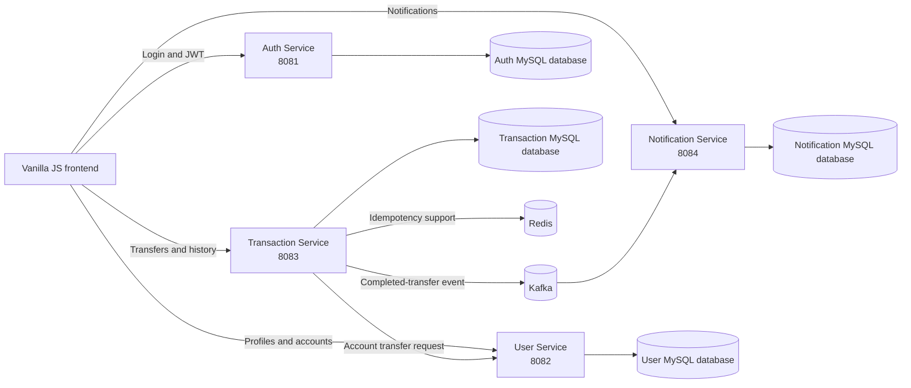

# Distributed Banking System

A microservices-based banking application built with Java and Spring Boot, providing secure authentication, user and account management, money transfers, and event-driven notifications.
## Architecture overview




## Features

- JWT-based authentication and role-based access control (ADMIN/USER) using Spring Security and BCrypt.
- Admin-managed user creation and profile change approval workflow.
- Secure money transfers with atomic transactions, pessimistic locking, and Redis-based idempotency.
- Transaction history and duplicate-request protection for reliable transfer processing.
- Event-driven in-app notifications using Apache Kafka.
- MySQL persistence with Flyway database migrations and a vanilla HTML/CSS/JavaScript frontend.

## Microservices

| Service | Responsibility |
|---|---|
| Auth Service | User authentication and JWT token generation |
| User Service | User profiles, accounts, balances, and profile change requests |
| Transaction Service | Money transfers, transaction history, and idempotency |
| Notification Service | Kafka-based transaction notifications |

## Tech Stack

**Backend:** Java 21, Spring Boot, Spring Security, Spring Data JPA

**Database:** MySQL, Flyway

**Messaging:** Apache Kafka

**Idempotency:** Redis

**Authentication:** JWT, BCrypt

**Frontend:** HTML, CSS, JavaScript

**Build Tool:** Maven

## Transfer Workflow

The Transaction Service coordinates money transfers and maintains transaction status. Redis-based idempotency prevents duplicate requests, while the User Service performs the debit and credit atomically using pessimistic locking.

After a successful transfer, the Transaction Service publishes a transaction-completed event to Kafka. The Notification Service consumes the event and creates in-app notifications for the sender and receiver.

## Project Structure

```text
distributed-banking-system/
├── auth-service/
├── user-service/
├── transaction-service/
├── notification-service/
├── frontend/
└── docker-compose.yml
